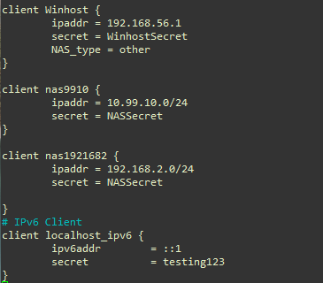

# FreeRADIUS in Ubuntu 

_Khaled Mahmud, April 2022_


---


## 1. Prerequisite

### 1.1 Software

- [Ubuntu 18 LTS Server](http://archive.ubuntu.com/ubuntu/dists/bionic/main/installer-amd64/current/images/netboot/)
- [FreeRADIUS v3](https://freeradius.org/): Radius Server
- [NTRadPing](https://community.microfocus.com/collaboration/oes/w/oes_tips/9928/ntradping-1-5-radius-test-utility): For testing radius connection; installed in Windows machines
- Any Adroid-based Radius protocol testing tool (optional)


<hr>


### 1.2 Topology

To follow along this guide, use [Oracle VirtualBox](https://www.virtualbox.org/) to create the required topology. The topology diagram is given below. As you can see, VirtualBox (VB) is in a windows host machine. I am assuming a clean Ubuntu Server 18.04 LTS installation for FreeRadius installation. You can definitely use other versions of Ubuntu or any other Linux distro. However, for this guide, all the configurations and screenshots are from the Ubuntu server installed in a VM in VirtualBox, as shown. 


#### Figure: Network Topology


Create a VM with two network interfaces. 
1. **Adapter 1**: For connecting to the internet using *NetNetwork1* of VirtualBox. If you do not already have a NetNetwork, just create one from the *Preference* menu of VB. You can use NAT adapter. But I chose to use NetNetwork control the IP subnet and port forwarding.
1. **Adapter 2**: For connecting the windows host using *Host-Only Ethernet Adapter* interface.

Following figures show the network configuration values used in this guide. Your values may be different.

#### Figure: VirtaulBox NetNetwork settings


#### Figure: VirtaulBox Host-Only Ethernet Adapter Settings


#### Figure: Host-Only Network Adapter in the Windows Host


> @icon-info-circle Note: I used VirtualBox in this guide. You can use VMWare or any other virtual environment or even bare metal to perform the tests shown in this guide. The network configurations will be slightly different.


---
### 1.3 Ubuntu Preparation

#### 1.3.1 Ubuntu Server


Use a clean install of Ubuntu server. I used [Ubuntu 18 server](http://archive.ubuntu.com/ubuntu/dists/bionic/main/installer-amd64/current/images/netboot/). Perform update and upgrade.

```bash
sudo apt update
sudo apt upgrade -y
```
--- 
#### 1.3.2 IP Configuration

Edit the **netplan** file of Ubuntu to configure the network interfaces. Enable **DHCP** on both the adapters. The yaml file for netplan is in **`/etc/netplan`** directory. Your netplan yaml file should look similar to this. Use appropriate interface names. Exact name of the file may depend on your Ubuntu installation.
```
sudo nano /etc/netplan/<netcofig_yaml_file>
```

```yaml
network:
  version: 2
  renderer: networkd
  ethernets:
    enp0s3:
      dhcp4: yes
    enp0s8:
      dhcp4: yes
```
#### Figure: Sample Netplan Configuration


After editing the netplan yaml file, update the interfaces using `netplan apply` command.

```bash
sudo netplan apply
```

Once edited **netplan** is applied, the interfaces should have updated IP addresses. Use `ip address` command to view the interface status. The following figure shows the output from my configuration.

#### Figure: Ubuntu VM's Interface IP Addresses


<hr>

The following table summarizes the IP addresses of the topology. See also the topology diagram above. Again, your values will/may be different.
#### Table 1: IP addresses in the topology for the example setup of this guide

| Item                                               | Value        |  
|:----------------------------------------------------|--------------:|
| Windows host, VirtualBox Host-Only Ethernet Adapter              | 192.168.56.1 |  
| Ubuntu VM, Host-Only Ethernet Adapter    | 192.168.56.101 |  
| Ubuntu VM, NetNetwork1 Adapter | 10.99.10.4     |  

---
#### 1.4 Test Connectivity


From Windows host, ping the Host-Only Adapter's IP address of Ubuntu to make sure the host can reach the server.

#### Figure: Ping from Windows host to Ubuntu VM


Once you have access to the server from Windows, you can use SSH (e.g., using Putty) to logon to server to perform the rest of the configuration and testing activities. 


#### Figure: Putty Access to Ubuntu VM from Windows Host


---

---

##  2. FreeRADIUS 

### 2.1 Install FreeRADIUS Server
Install <a href="https://freeradius.org/" target="_blank">freeRadius</a> server in Ubuntu VM. 
```bash
sudo apt-get install freeradius
```

Once the installation completes, FreeRadius server should be already running. Use `sudo systemctl status freeradius` command to see the status of the service.

#### Figure: Running Status of FreeRadius Server


---
### 2.2 Basic Configuration 

Configuration files of FreeRadius are stored in `/etc/freeradius/3.0` directory. Here is the list of contents of the directory.

#### Figure: Contents of Configuration Directory 


#### 2.2.1 Client (NAS) Configuration

Information about radius clients (AKA Network Access Server, **NAS**) are stored in `/etc/freeradius/3.0/clients.conf` file. Note that according to *IEEE802.1X* protocol, the **authenticator** is the radius **client**.

In freeradius, information about radius clients (Authenticators or Network Access Servers or (NAS)) are configured in `clients.conf` file. 
Edit `clients.conf` file to add **localhost** as a NAS with the following values. By default **localhost** entry should already be there in the `client.conf` file.

```yaml
client localhost {
    ipaddr = 127.0.0.1
    secret = testing123
    NAS_type = other
}
 ```
 
<br>
To allow the Windows host to access the radius server (for testing) add another client entry, as below.

```yaml
client Winhost {
    ipaddr = 192.168.56.1
    secret = WinhostSecret
    NAS_type = other
}
```
<br>
To allow a client from the 10.99.10.0/24 subnet (NetNetwork1, see the topology diagram), add one more entry. Notice that `ipaddr` value is a range, not a specific IP address. This means any host from this range can make access request to the radius server.

#### Figure: Sample Clients (NAS) in `clients.conf` File


---
#### 2.2.2 User Configuration

Radius users are configured in `/etc/freeradius/3.0/users` file which is the local database. Note that according to *IEEE802.1X* protocol, the **supplicant** is the radius **user**.

Edit `users` file to add a few test users with these values.
```yaml
local-test-user Cleartext-Password := "testuserpass"
                Reply-Message := "Hello from FreeRadius Server, to %{User-Name}"
user1 Cleartext-Password := "user1pass"
user2 Cleartext-Password := "user2pass"
```
Notice the particular formatting structure of `users` configuration file. Refer to the [online man pages](https://freeradius.org/radiusd/man/) for details. You can also study the examples given in the `users` file. Here is a screenshot of the `users` file after adding the test users. 

#### Figure: Sample Users in `users` File


---
#### 2.2.3 Restart the Server

For any changes in the `clients.conf` or `users` files to take effect, the server must be restarted.

```bash
sudo systemctl restart freeradius
```
:bulb:
You can verify the status of the server using `sudo systemctl status freeradius` command.

---

### 2.3 Test the Server

Now you can test the radius server with the configures done so far. Let us verify if the radius server is accessible from the permitted clients, and the server accepts requests from configured users.

#### 2.3.1 Using Built-in Tool

Freeradius comes with a command line test tool called `radtest`. Use the tool to test the client and users as shown below.

#### Figure: `radtest` Usage


#### Figure: Test Result for `local-test-user`


#### Figure: Test result for `user1`


Note that these tests are run from the same host where **freeradius** is installed. That is why the NAS-IP-Address (i.e. the client IP address) is 127.0.0.1 (localhost). We configured the `clients.conf` file to allow access from **localhost**.

:closed_lock_with_key:After successful testing, you can remove the **local-test-user**.

<hr>

---
#### 2.3.2 Test Radius Server From Windows


In the Windows host PC, we can run a radius protocol testing tool, called [**NTRadPing**](https://community.microfocus.com/collaboration/oes/w/oes_tips/9928/ntradping-1-5-radius-test-utility). In this test scenario, the host PC is the NAS (as we configured earlier in `clients.conf` file). We can test the *Authentication Request* for the users we created.

Here is the result for **user1**. You should see a response of *Access-Accept*.

#### Figure: Successful Access Request


---
#### 2.3.3 Running Free Radius Server in Debug Mode

**Freeradius** can run in debug mode. First stop the service if it is already running using the command `sudo systemctl stop freeradius`. Then start the server in debug mode using the command `sudo freeradius -X`. The server will start with a display similar to the following figure.

#### Figure: FreeRadius Running in Debug Mode


<br>

In the debug mode, the console displays information regarding incoming request and server's responses.  The following two figures show an authentication request from `user2`, with PAP (*Password Authentication Protocol*) as authentication method. Notice the client's IP address.

#### Figure: Access Request (PAP) Test


The following figrure is for a request from `user2`, using CHAP (*Challenge Handshake Authentication Protoocl*). Notice the detected password.

#### Figure: Access Request (CHAP) Test


---
#### 2.3.4 Protocol Format Details
While sending test authentication requests, you can capture radius procotol frames in Windows host using **wireshark**. 

The the following two figures are the wireshark captures showing the details of Access-Request and Access-Accept frames corresponding to a PAP-based authentication request from `user2`. 

#### Figure: Wireshark Capture of Authentication Request/Reply (PAP)


The following two figures are the wireshark captures showing the details of Access-Request and Access-Accept frames corresponding to a CPAP-based authentication request from `user2`.

#### Figure: Wireshark Capture of Authentication Request/Reply (CHAP)


---
---
## 3. Port Forwarding for VM-based Radius Server

As we saw in the previous section, windows host can access the radius server using the host-only interface. However, any host from outside cannot access it as the ubuntu VM is running behind a NAT. 

Let us enable **port forwarding** in VitualBox to allow external hosts to access the radius server port in the VM. The eventual topology is given below. In this topology, after port forwarding enabled, hosts in 192.168.2.0/24 LAN should be able to access the VM's radius server port. 

#### Figure: Topology to Allow Access From Outside  


To enable port forwarding in NetNetwork1, configure **Port Forwarding** in **NAT Network Details** of **NetNetwork1**. See the figure below.

#### Figure: NetNetwork Configuration


Add a *forwarding rule*, as shown below. Notice that the freeradius server is running on port 1812 for authentication access requests. The transport protocol is UDP. For this guide we are not forwarding accounting port, which is 1813.

#### Figure: Port Forwarding Rule Congifuration in VirtualBox


To allow hosts from 192.168.2.0/24 network (see the topology above), add a `client` entry in the `clients.conf` file, as shown below. This entry allows any IP address from the whole subnet.


```yaml
client Winhost {
        ipaddr = 192.168.56.1
        secret = WinhostSecret
        NAS_type = other
}

client nas9910 {
# Whole subnet is specified here. Any VM running in the subnet is allowed
        ipaddr = 10.99.10.0/24
        secret = NASSecret
}

client nas1921682 {
#Whole subnet is allowed here. 
#Any host running in the subnetted can access
#You can specify just one IP address
        ipaddr = 192.168.2.0/24
        secret = NASSecret
}
```
<br>

Here is the relevant part of the file after the change.

#### Figure: `clients.conf` File


For the sake of testing, add a new user, `user3`, in the `users` file. Notice that the server will return a `Reply-Message` after successful authentication of `user3`.

#### Figure: `users` File with `user3` Added


You can use any device and any radius client software to test the server from 192.168.2.0/24 subnet. The following figure shows successful access from an Android device, using **Simple Radius Test Tool**. Corresponding wireshark captures and freeradius debug outputs are also shown.

#### Figure: Adroid Client


<br>

Here is the result of a successful access request from another windows host (see the topolgy above) in 192.168.2.0/24 subnet. This time `user3` was used to make the request.

#### Figure: Test of `user3` from External Network


---
---
*© Khaled Mahmud, 2022*
